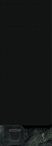

  

<table>
  <tr>
    <td align="center" width="150">
      
    </td>
    <td>
      <h2>What it does</h2>
      <ul>
        <li>Groups installed applications into compact categories.</li>
        <li>Opens from the menu bar, a global shortcut, or the screen-edge tab.</li>
        <li>Adds apps through the picker or by dragging them onto the panel.</li>
        <li>Supports launch at login and native Finder folder export.</li>
      </ul>
    </td>
  </tr>
</table>

  

