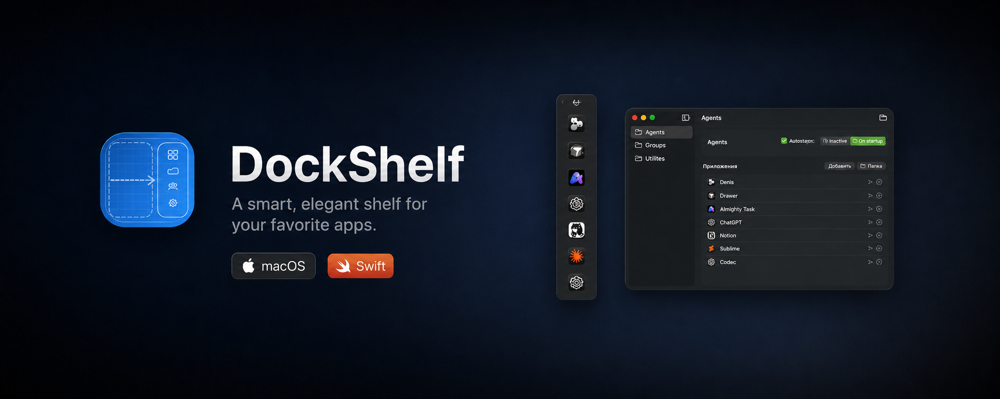

  

<strong><big><big><big>DockShelf</big></big></big></strong>    is a lightweight macOS utility for keeping frequently used apps in a compact side shelf. It stays out of the Dock, opens from the menu bar or edge trigger, and lets you organize launch shortcuts into clean categories.

### What it does

- Groups installed applications into compact categories.
- Opens from the menu bar, a global shortcut, or the screen-edge tab.
- Adds apps through the picker or by dragging them onto the panel.
- Supports launch at login and native Finder folder export.

 

  

<pre hspace="12">
   Telegram ······ <a href="https://t.me/Jas953/">t.me/Jas953</a>
   LinkedIn ······ <a href="https://www.linkedin.com/in/jas952/">linkedin.com/in/jas952</a>
   X        ······ <a href="https://x.com/not__jas">x.com/not__jas</a>
</pre>
 
