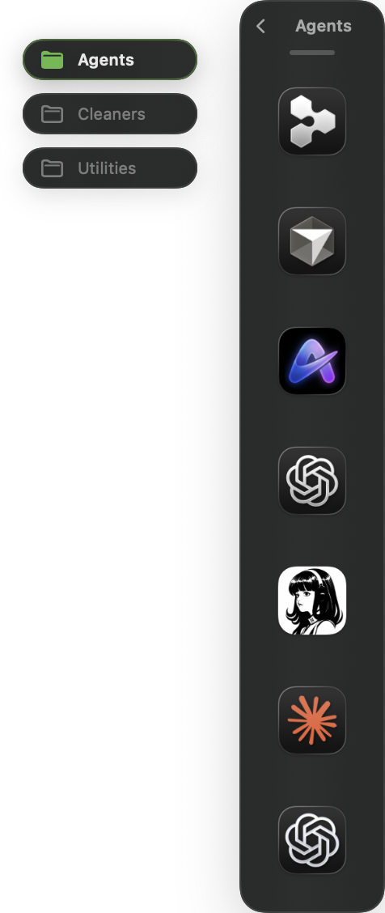
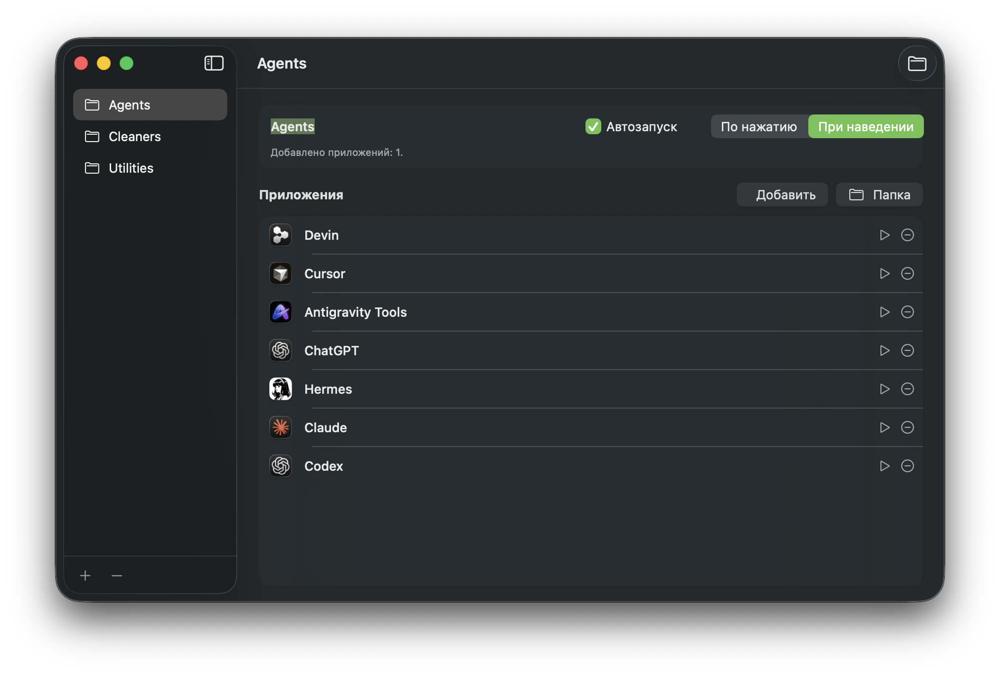

<div align="center">

# DockShelf

**A quiet home for the apps you reach for most.**

DockShelf is a native macOS menu-bar launcher that groups applications into simple categories and keeps them one gesture away, without adding another icon to your Dock.

[Demo](#demo) · [Build from source](#build-from-source) · [Documentation](docs/architecture.md)

</div>

## Designed for a clean desktop

Create categories such as Agents, Utilities, or Cleaners. Add any installed app, then open its shortcuts from the menu bar, `Option + Space`, or the small tab at the lower-right edge of the screen.

<p align="center">
  
  
</p>

## What it does

- Keeps DockShelf out of the Dock as a menu-bar utility.
- Opens a compact launcher panel from the right side of the screen.
- Lets you add apps by selecting them or dragging an app bundle onto the panel.
- Supports click or hover activation, launch at login, and a native Finder folder export for Dock Stacks.

## Demo

[Watch the 12-second onboarding demo](docs/media/onboarding-demo.mp4)

## Build from source

Requires macOS 13+ and Xcode Command Line Tools.

```bash
git clone <your-repository-url>
cd DockShelf
./script/build_and_run.sh
```

For release packaging and the project internals, see [docs/releasing.md](docs/releasing.md) and [docs/architecture.md](docs/architecture.md).
